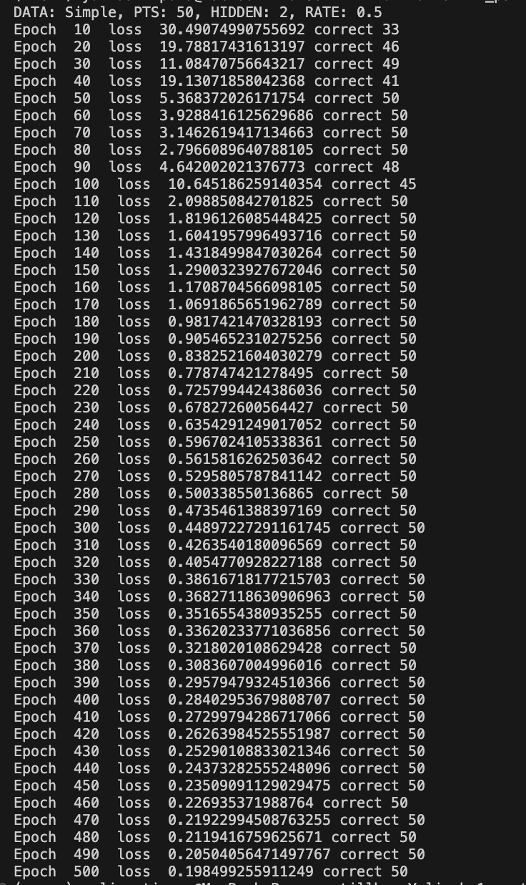
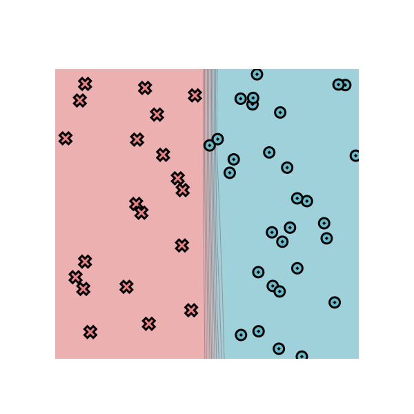
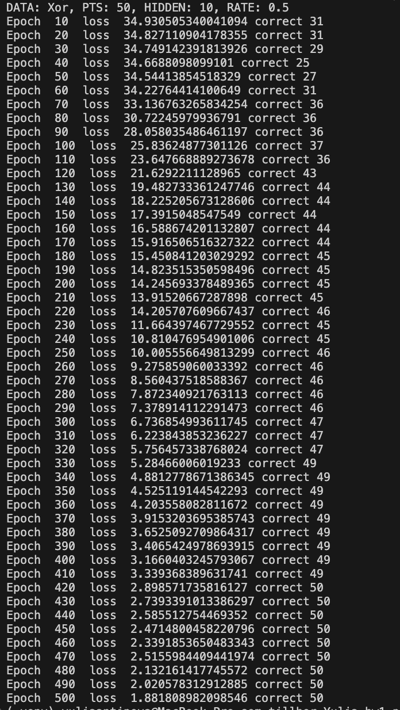
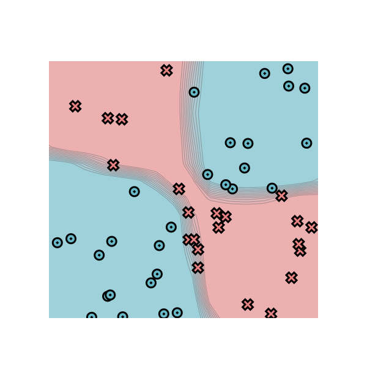

# minitorch
The full minitorch student suite. 


To access the autograder: 

* Module 0: https://classroom.github.com/a/qDYKZff9
* Module 1: https://classroom.github.com/a/6TiImUiy
* Module 2: https://classroom.github.com/a/0ZHJeTA0
* Module 3: https://classroom.github.com/a/U5CMJec1
* Module 4: https://classroom.github.com/a/04QA6HZK
* Quizzes: https://classroom.github.com/a/bGcGc12k

# Task 1.5

## Simple

### Configuration

```text
DATA: Simple
PTS: 50
HIDDEN: 2
RATE: 0.5
```

<p align="center">   </p>

## XOR

### Configuration

```text
DATA: XOR
PTS: 50
HIDDEN: 10
RATE: 0.5
```

<p align="center">   </p>